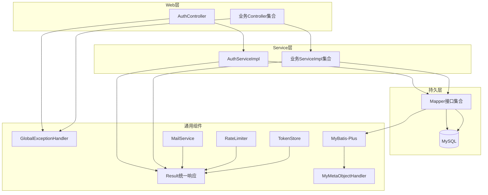
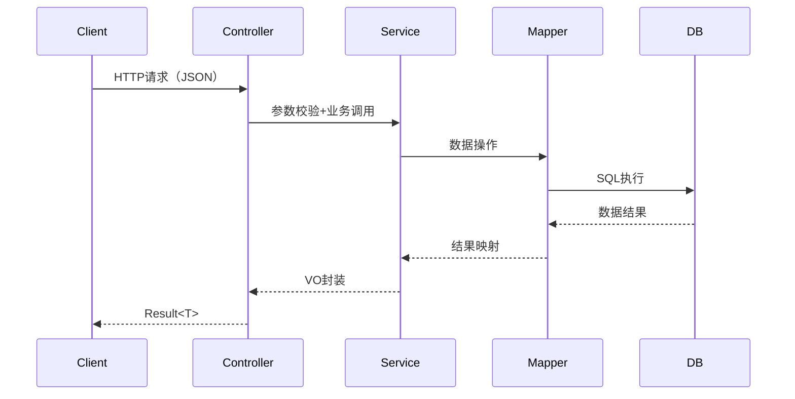
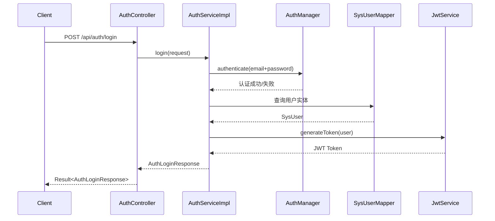
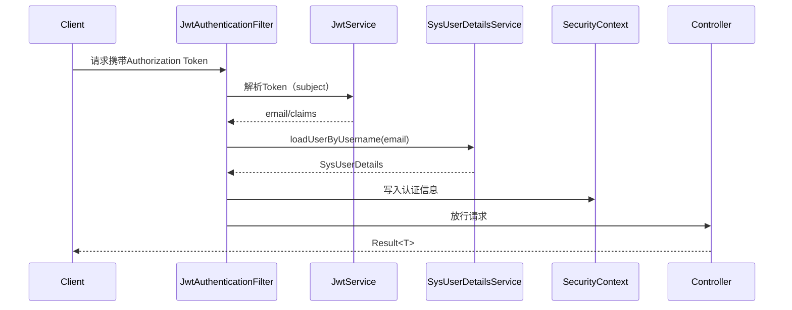
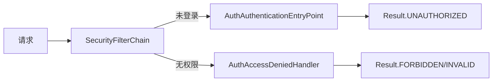
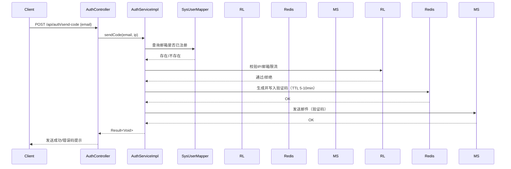
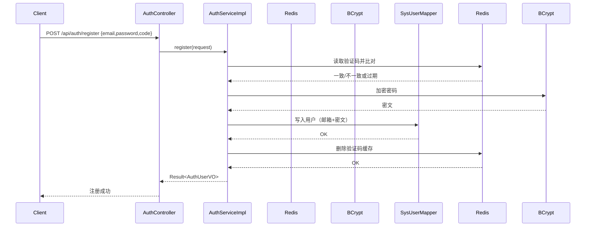
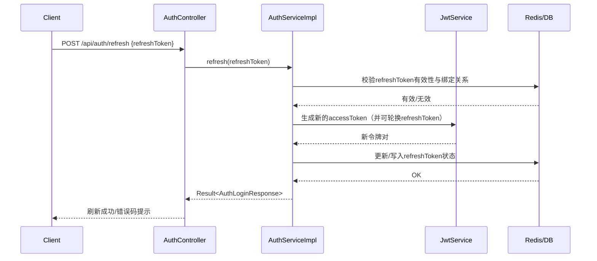
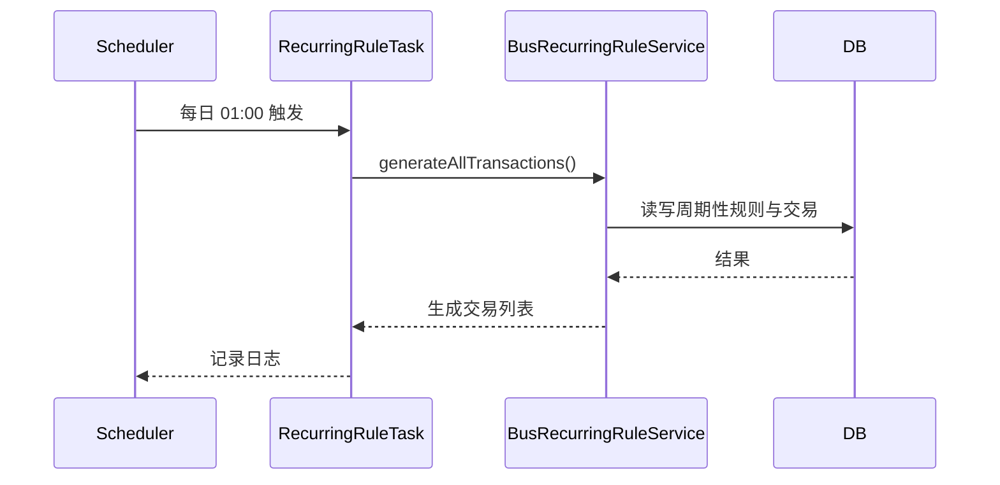

# 架构图文档（money-flow-backend）

## 项目信息
- 项目名称：money-flow-backend（Spring Boot 3.5.10）
- JDK：17
- 数据库：MySQL 8.0+
- 持久层：MyBatis-Plus
- 认证方式：JWT
- 统一响应与异常处理：Result + 全局异常处理
- 缓存：Redis（验证码、限流、令牌）
- 邮件服务：SMTP（Spring Mail）

## 分层架构概览
- Controller：承接 HTTP 请求、参数校验、输出统一 Result
- Service：业务逻辑聚合
- Mapper：MyBatis-Plus 数据访问
- Entity/DTO/VO：实体、入参、出参模型

## 系统架构图（逻辑视图）

## 核心流程：请求处理链路

## 认证与授权架构流程图（JWT）

### 1）登录流程

### 2）带Token访问流程

### 3）未认证/无权限处理

### 4）发送邮箱验证码流程

### 5）注册（邮箱+验证码）流程

### 6）刷新令牌流程

## 数据层与自动填充机制
- 逻辑删除：全局逻辑删除字段为 delFlag，删除值 1，未删除值 0
- 自动填充：创建/更新时自动填充 createBy/createTime/updateBy/updateTime
- 分页与拦截器：MyBatis-Plus 分页插件

## 定时任务流程

## 模块与接口域概览（按Controller分组）
- 认证管理：/api/auth/*
  - POST /api/auth/send-code（发送邮箱验证码）
  - POST /api/auth/register（邮箱验证码注册）
  - POST /api/auth/login（邮箱+密码登录）
  - POST /api/auth/refresh（刷新令牌）
- 账户管理：/api/accounts
- 交易管理：/api/transactions
- 分类管理：/api/categories
- 预算管理：/api/budgets、/api/budget-items
- 目标管理：/api/goals、/api/goal-records
- 标签管理：/api/tags、/api/transaction-tags
- 系统模块：用户、设备、登录日志
